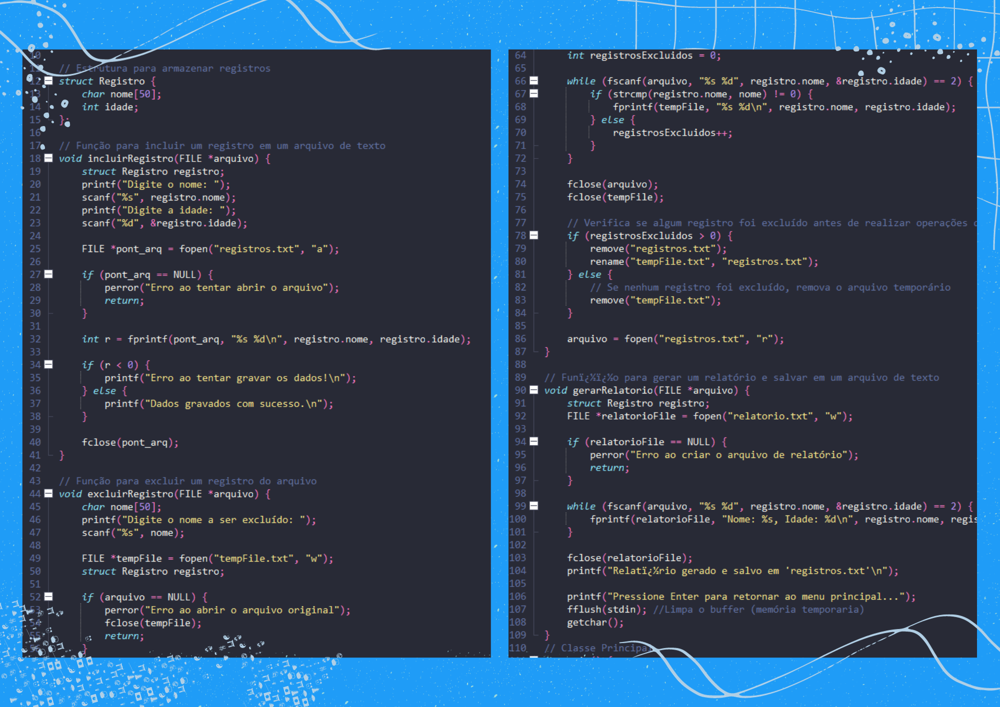

  <!-- divider imagem -->

 
  <!--imagem anime + linha-->

 <!-- titulo-imagem + fechamento da div inicial-->

### ꒱ hello world! ・.・✫・
Aqui temos um projetinho/exercício feito para a aula de **Técnicas de Algoritmos**.
É um programinha simples de cadastros feito em linguagem C, com funções de salvar e excluir um log em arquivo texto dos nomes e idades cadastrados.  

Esse projeto foi feito em grupo pelas seguintes alunas do segundo semestre de Ciencia da Computação:
- <a href="https://github.com/Amandasfs"> Amanda de Freitas </a> 
- <a href="https://github.com/AnaLuizaGuilherme"> Ana Luiza Guilherme </a>
- <a href="https://github.com/bruniibs"> Bruna Sant'Ana </a>
  
###### "As coisas só são feitas se os dados que coletamos puderem informar e inspirar aqueles que estão em condições de fazer a diferença" Mike Schmoker, Author. 

 

### ꒱ imagens codigo ・.・✫・

  

